# Charger Design Process

## Step 1: Base Sketch
In this step, I created a 6 sketches: 4 Sketches on the Top Plane, Sketch on the Front Plane and Sketch on the Right Plane to define the base shape of the charger.

### On The Top Plane:
- Sketch1: to set the external charger body Dimensions.

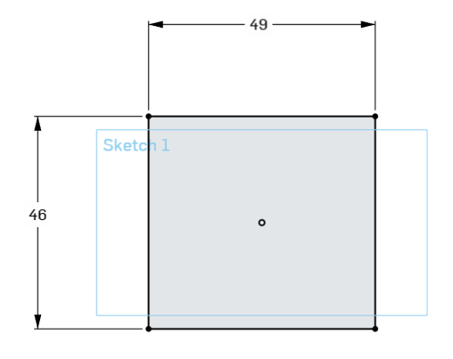

- Sketch2: to set the negative and positive poles Dimensions.

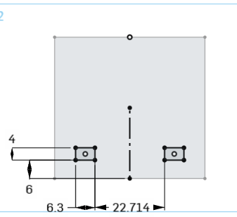

- Sketch3: to set the ground pole Dimensions.

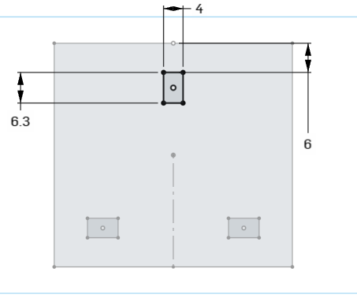

- Sketch4: to set the position poles closure points Dimensions.

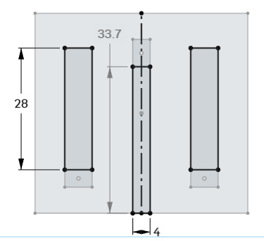

### On The Front Plane:
- Sketch5: to set the position of Type-C Port Dimensions.

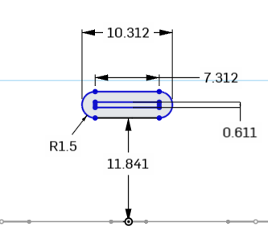

### On The Right Plane:
- Sketch6: to set the position of grip Dimensions.

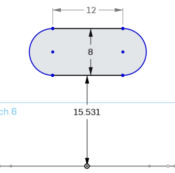

---
## Step 2: Extrude the Base
The base sketch was extruded to create the main body of the charger.
- Extrude1: for Sketch1 with depth 30mm

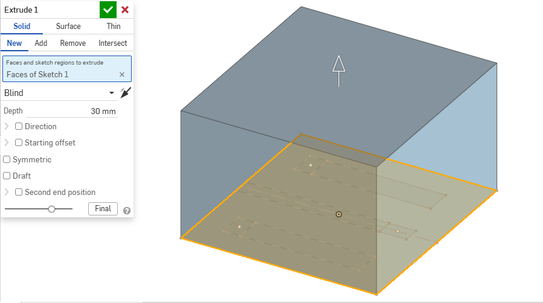

- Extrude2: for Sketch2 with depth 22mm and offset 26mm

.png)

- Extrude3: for Sketch3 with depth 29mm and offset 24mm

.png)

- Extrude4: for Sketch4 (Extrude remove) with depth 6.3mm and offset 30mm

- Extrude5: for Sketch5 (Extrude remove) with depth 10mm and offset 25mm

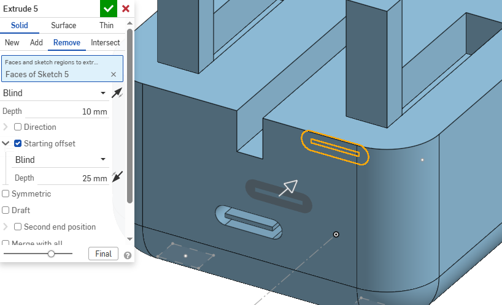

- Extrude6: for Sketch6 (Extrude remove) with depth 1.5mm and offset 23mm

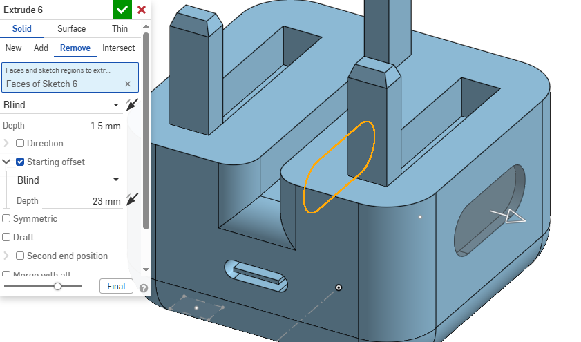

- Extrude7: for Sketch6 (Extrude remove) with depth 1.5mm and offset 23mm

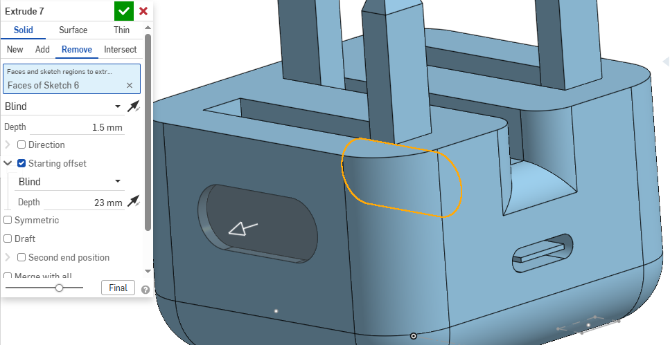

---
## Step 3: Final Details
Additional fillets and small features were added to improve the design.
- Chamfer1: for Extrude2 with distance 2mm and angle 20deg

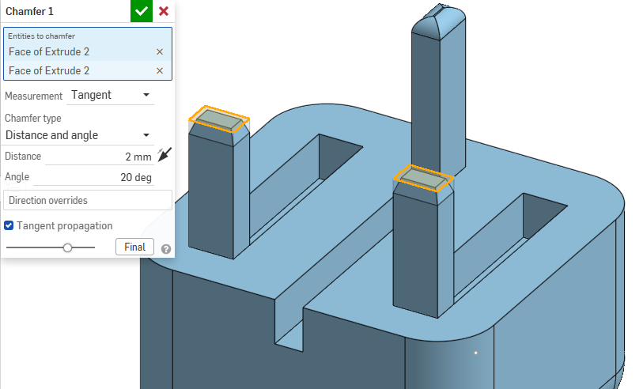

